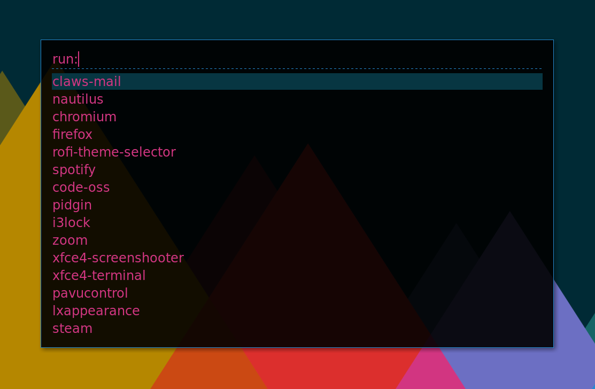

# rofi-solarized-darker-theme
A [rofi](https://github.com/DaveDavenport/rofi) theme based on the [Solarized](http://ethanschoonover.com/solarized) color scheme but a bit darker. I love solarized but I want some contrast in my launcher. Here's a screenshot:

Note that I'm showing 15 lines and using `System San Francisco Display 18` as my font (see installation notes for additional info).

## Installation
Assuming you have the latest version of rofi properly installed, you can install/update this theme using the following command:

`sudo curl -o /usr/share/rofi/themes/solarized-darker.rasi https://raw.githubusercontent.com/DeanPDX/rofi-solarized-darker-theme/master/solarized-darker.rasi`

Next you need to select the theme. I use [i3wm](https://i3wm.org/) so I just bind the following to my launcher keystroke:

`bindsym $mod+d exec rofi -show run -lines 15 -font "System San Francisco Display 18" -theme "solarized-darker"`

As you can see, I am passing the theme in as an argument. You can also launch `rofi-theme-selector` and preview/select the theme that way.

The theme is also available in the [User Themes](https://github.com/DaveDavenport/rofi-themes/tree/master/User%20Themes#solarized-darker) section of the official rofi-themes repository.
